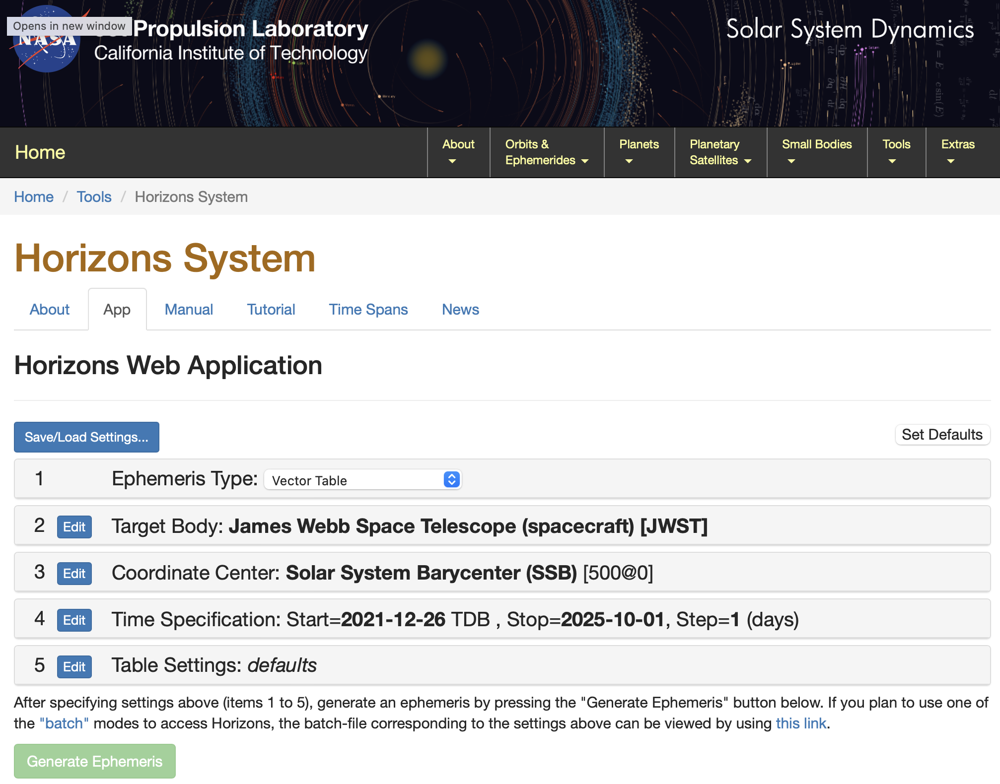

Satellite Parallax
=========================
BAGLE supports observers that are not located at Earth so long as an ephemeris can
be downloaded from the JPL Horizons web app.

Models with Satellite Parallax
------------------------------

Fetching Emphemerides from JPL Horizons
---------------------------------------
The `JPL Horizons <https://ssd.jpl.nasa.gov/horizons/app.html#/>` calculator can be run in
Vector Table mode for any space telescope already launched. An example of JWST is shown
below:

